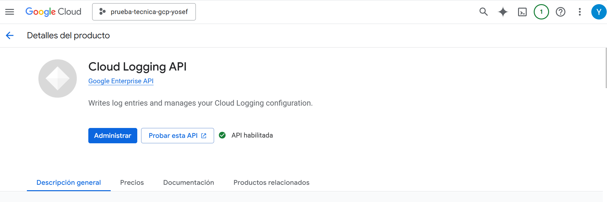
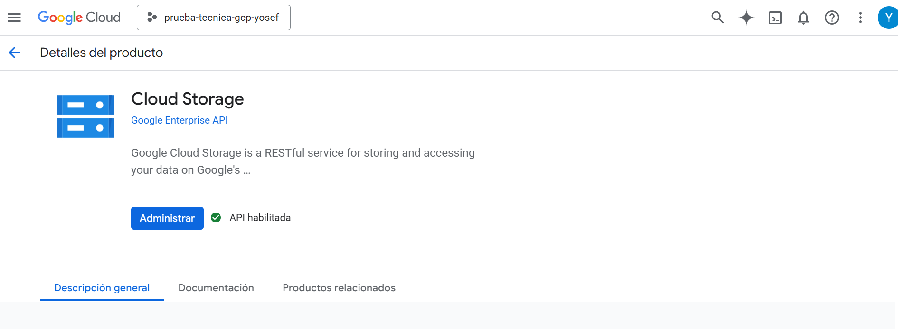
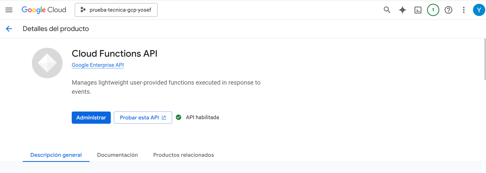
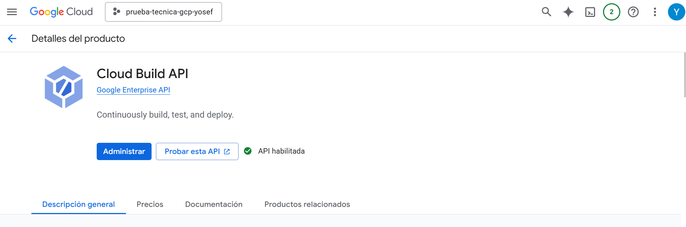
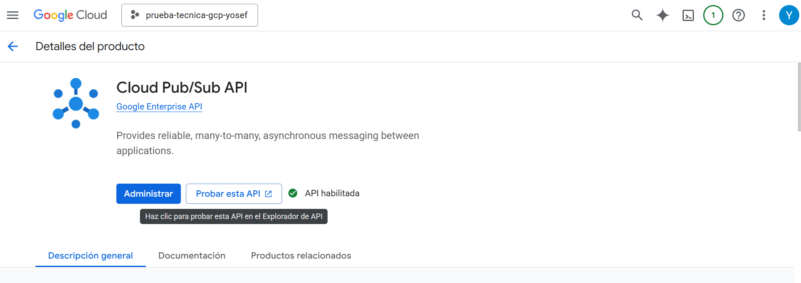
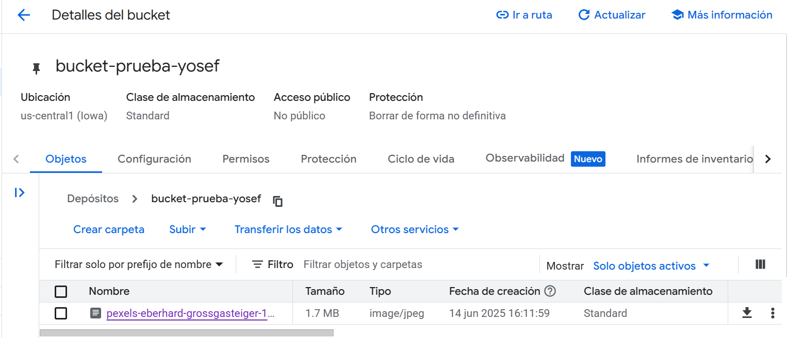
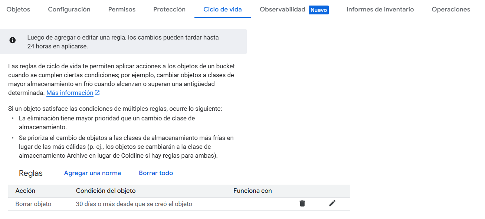
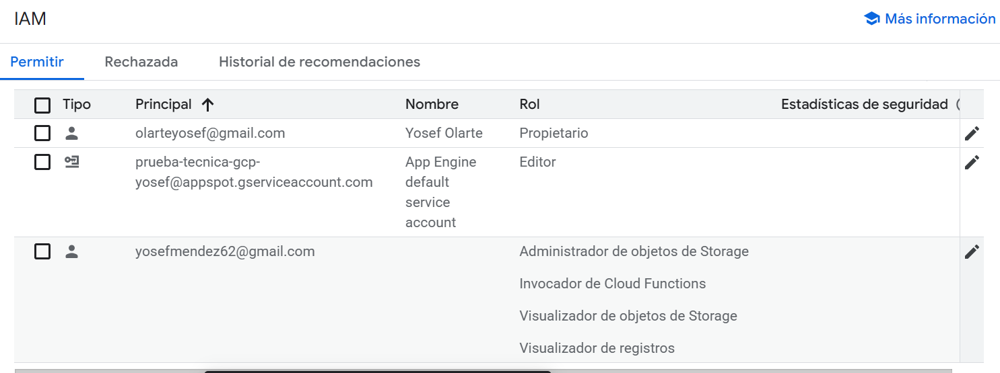
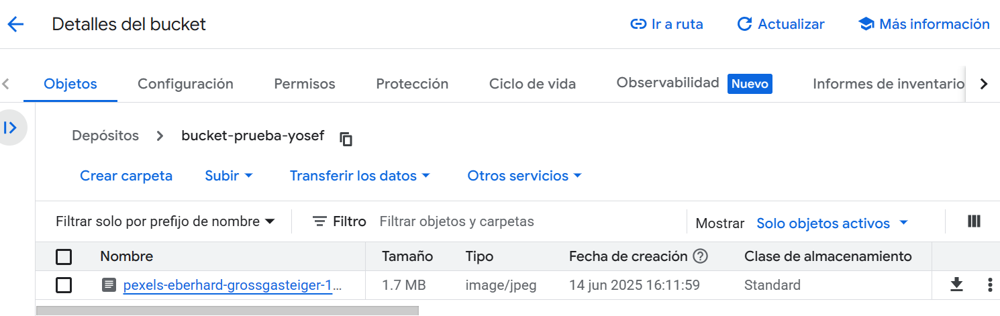
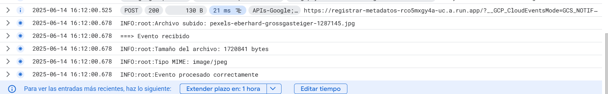

# 📂 Extracción de Metadatos en Google Cloud Functions

Este proyecto implementa una función en Python 3.10 para **Google Cloud Functions** que registra automáticamente metadatos (nombre, tamaño y tipo MIME) de archivos subidos a un bucket de **Google Cloud Storage**, y los envía a **Cloud Logging** para monitoreo y análisis.

---

## 🚀 Objetivo

Crear y configurar un entorno seguro y escalable en GCP.
Detectar automáticamente archivos subidos y registrar sus metadatos en el sistema de registros de GCP.

---

## 🛠️ Tecnologías usadas

- Python 3.10
- Google Cloud Functions 
- Google Cloud Storage
- Cloud Logging
- Functions Framework 

---

---

## 🔄 Diagrama de flujo del proceso

1. **Usuario sube archivo al bucket**  
   Se añade un archivo manualmente o por medio de una aplicación al bucket configurado en GCS.

2. **Se activa el trigger de Cloud Function**  
   El evento de subida activa automáticamente la función sin necesidad de intervención humana.

3. **La función extrae y registra metadatos**  
   Se extraen tres atributos clave: nombre del archivo, tamaño en bytes y tipo MIME.

4. **Cloud Logging almacena el evento**  
   Se registran los metadatos para monitoreo, trazabilidad y diagnóstico del sistema.

---

## ✅ Habilitación de APIs necesarias

Estas APIs fueron activadas en el proyecto de GCP para garantizar el correcto funcionamiento del sistema:

- **Cloud Logging**  
  Permite registrar eventos personalizados y errores.  
  

- **Cloud Storage**  
  Servicio para almacenar objetos y activar funciones mediante eventos.  
  

- **Cloud Functions**  
  Plataforma sin servidor para ejecutar código en respuesta a eventos.  
  

- **Cloud Build**  
  Se utiliza en segundo plano para desplegar la función.  
  

- **Cloud Pub/Sub**  
  Sistema de mensajería usado por Cloud Functions para recibir eventos.  
  

---

## 🪣 Creación del bucket

Se creó un bucket desde la consola de GCP con permisos y ubicación definidos.

---

## ♻️ Configuración del ciclo de vida

Se aplicó una política para eliminar archivos automáticamente después de 30 días, lo cual ayuda a mantener el almacenamiento optimizado.

---

## 🔐 Roles y permisos

Se asignaron permisos mínimos necesarios a la cuenta de servicio que ejecuta la función. Estos permiten leer los objetos del bucket y escribir en los registros.

---

## 🧠 Desarrollo de la Cloud Function

### Lenguaje
- Python 3.10

### Lógica de la función
- Se activa mediante eventos de tipo **CloudEvent**.
- Extrae el nombre del archivo (`name`), el tamaño (`size`) y el tipo MIME (`contentType`) del objeto subido.
- Registra la información en Cloud Logging para su trazabilidad.
- Incluye manejo robusto de errores y registros detallados con `logging.error()` y `exc_info=True`.

> 🔧 El código fuente completo se encuentra en `main.py`, al igual que los requerimentos en `requiremenst`

---

## ⬆️ Subida de archivo al bucket

### Una vez desplegada la función y configurado el bucket, sube un archivo 

---

## 📘 Registro exitoso en Cloud Logging

### Verificacion de los registros  en Logs Explorer

